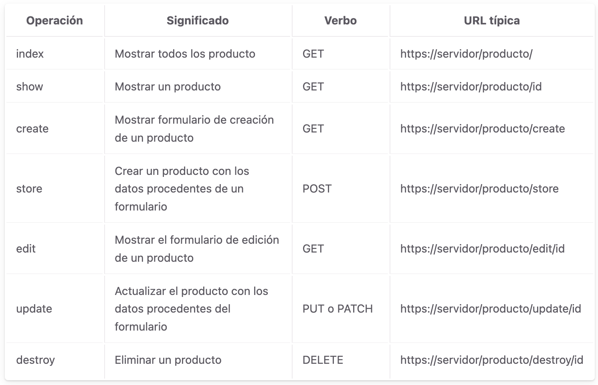
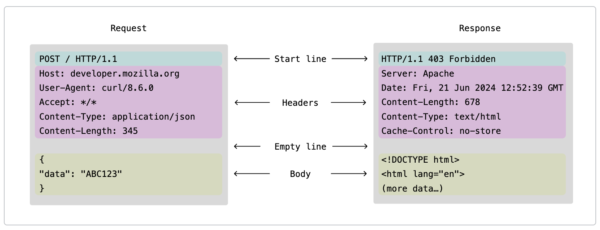
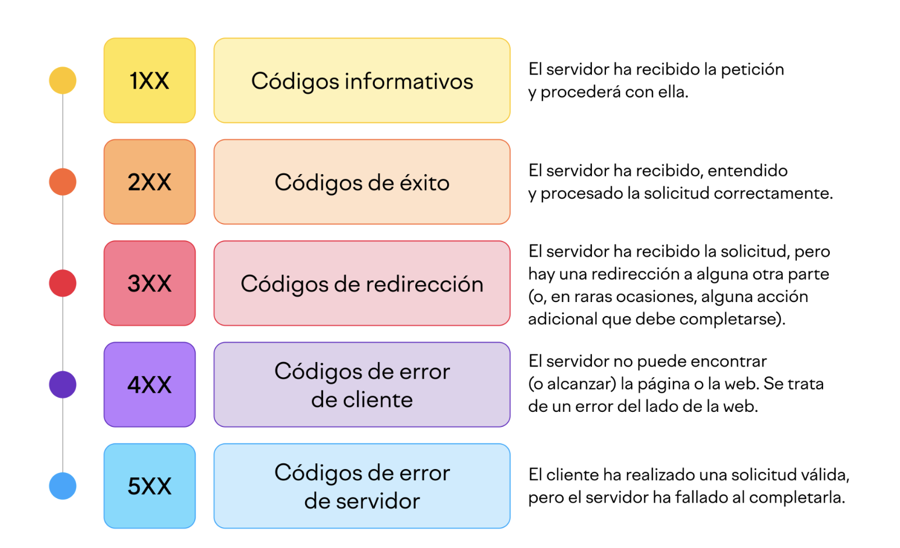

# 📘 Introducción a los Servicios Web y las API

## 🌐 ¿Qué son los Servicios Web?

Los servicios web surgieron a principios de los años 90, gracias a la rápida evolución de Internet, de las LAN y las WAN. En la década de los 80 se crearon muchas aplicaciones con diferentes lenguajes de programación y en sistemas operativos distintos. Surgió la **necesidad de intercambiar información** entre dichos sistemas y gracias a esto, surgieron los servicios web dando solución a este problema.

Un **servicio web** permite que dos aplicaciones se comuniquen entre sí
a través de Internet.

Los servicios web pretenden solucionar el problema de intercambio de información entre aplicaciones. Su nombre viene dado debido a que fueron diseñados para residir en un servidor web. La invocación de estos servicios suele ser a través de HTTP o HTTPS

<div style="text-align:center">

</div>


Podemos describir un servicio web de forma técnica como un **componente de software** que es accesible a través de la red. Engloba varias tecnologías aunque en sí mismo no podemos catalogarlo como una tecnología. Yo diría que es más bien un método o una forma de poder intercambiar información a través de protocolos y de estándares como, XML, HTTP, SOAP, REST y WSDL.


## Características de los servicios web
La finalidad de los servicios web es la transmisión de datos entre sistemas distintos, esto se puede hacer de muchas maneras pero, para que se considere un servicio web debe cumplir ciertas características.

 - Debe ser accesible a través de la red o Internet, normalmente mediante los protocolos HTTP.
 - La codificación de los mensajes deben ser en un lenguaje estándar como **XML o JSON**.
 - Debe contener una descripción de sí mismo para que cualquier aplicación pueda consumirlo de una forma automática.
 - Debe poder ser localizado y disponer de un mecanismo para encontrarlo de una manera automática.

## Tipos de servicios web: 🧼 SOAP vs 🌿 REST

Existen dos grandes tipos de servicios: 

### Servicio 🔵 SOAP
SOAP (Simple Object Access Protocol) Se trata de un protocolo de comunicación estándar, bajo el amparo de la W3C, que define como se deben comunicar dos sistemas a través de archivos XML.

Este protocolo **estricto** estipula los mensajes SOAP con una **estructura definida**. Se pueden consultar las especificaciones técnicas que ofrece la W3C. Para ver un ejemplo puedes ir a la web https://www.webservicex.com/ donde puedes ver un mensaje SOAP típico y la respuesta por parte del servidor.

El punto fuerte de los servicios web SOAP es la **seguridad**, esto es lo que le hace diferente a los servicios web REST que veremos a continuación.

Ejemplo:

``` xml
<soap:Envelope>
  <soap:Body>
    <getUser>
      <id>5</id>
    </getUser>
  </soap:Body>
</soap:Envelope>
```


### Servicio 🟩 REST
REST (Representational State Transfer) Transferencia de estado representacional, también llamados RESTful, es una arquitectura de software para sistemas distribuidos.  Son servicios web más fáciles que usar y se suele decir que es la manera ágil de crear servicios web por su sencillez y flexibilidad.

Este tipo permite el intercambio de diferentes formatos de archivos estándar como XML y JSON. 

Se dice que este tipo de servicios está orientado a los recursos. Normalmente cada recurso tiene asignado una URI (endpoint) donde accedemos. 

Ejemplo:

    GET https://api.ejemplo.com/usuarios/5


## Diferencias entre servicio web y aplicacion web
Llegados a este punto, puede que estés pensando: “Vale, pero ¿en qué se diferencia todo esto de una aplicación web? ¿No intercambian también el cliente y el servidor información independientemente de la plataforma en la que se ejecuta cada uno?”.

Pues sí, pero hay algunas diferencias fundamentales entre un servicio web y una aplicación web:

 - Una aplicación web está diseñada para que un ser humano interactúe con ella a través de un interfaz DHTML. Un servicio web, en cambio, está pensado para que lo use otra aplicación informática (el cliente), no necesariamente un ser humano.
 - Por ese motivo, los servicios web suelen carecer de interfaz de usuario y no producen salidas HTML legibles. Es decir, un servicio web puro no suele tener vistas.
 - En cambio, los servicios web suelen producir salidas XML o JSON, pensadas para que los clientes las procesen. 


## Algunos conceptos

Endpoint: Un endpoint es una URL/URI concreta que accede a un recurso. Por ejemplo: 
  - GET /producto
  - GET /api/usuario/1
  - POST /login

API: Una **API** define cómo dos sistemas se comunican. Es el listado de endpoint que el servicio web, en este caso de tipo rest, ha definido (ejemplo de la API de las balizas v16).


## 🔹 Métodos HTTP

  - GET      Obtener datos
  - POST     Crear
  - PUT      Actualizar
  - PATCH    Actualizar parcialmente
  - DELETE   Eliminar


<div style="text-align:center">

</div>


## ¿Cómo se consume una api rest?
Hay software cliente de API (API Client software) que nos permite probar una api. El software más famoso es Postman, pero hay multitud de api client, al igual que hay multitud de clientes de base de datos. Incluso VSC tiene plugin cliente de API.

Por otro lado, ¿como se consume en una vista?

### 🌐 Ejemplo en JavaScript

``` javascript
fetch("https://jsonplaceholder.typicode.com/users")
  .then(r => r.json())
  .then(d => console.log(d));
```

### 🌐 Ejemplo en PHP

``` php
<?php
$ch = curl_init("https://jsonplaceholder.typicode.com/users");
curl_setopt($ch, CURLOPT_RETURNTRANSFER, true);
$res = curl_exec($ch);
curl_close($ch);
print_r(json_decode($res, true));
```


### Protocolo HTTP. Códigos de estado
Los mensajes HTTP son el mecanismo utilizado para intercambiar datos entre un servidor y un cliente en el protocolo HTTP. Existen dos tipos de mensajes: las solicitudes (requests) que envía el cliente para activar una acción en el servidor, y las respuestas (responses), que son la contestación que el servidor envía como respuesta a una solicitud.


<div style="text-align:center">

</div>


Cada vez que visitas una web, tu navegador envía una petición al servidor de la web. A continuación, el servidor responde con un código HTTP. Es como si mantuvieran una conversación. Y cada código indica si las cosas funcionan bien o si algo va mal. 

Un código HTTP es un número de tres dígitos que genera un servidor en respuesta a la petición de un navegador. Como el 404, por ejemplo, que probablemente hayas visto antes.


https://es.semrush.com/blog/codigos-de-estado-http/


<div style="text-align:center">

</div>


<div style="text-align:center">

</div>


## Algunas APIs publicas
Las API's pueden ser privadas o públicas. En este último caso, significa que todo el mundo las pueden usar. Estan disponibles para los consumidores de apis, y no hablo del paté.

Algunas apis son totalmente gratuitas, algunas son gratuitas despues de darte de alta y otras son de pago.

Puedes usar apis para incluirlas a tus aplicaciones. Por ejemplo, una api del tiempo, que te diga el tiempo que hace en una determinada ciudad. O una api de conversión de moneda. Puedes desarrollar una aplicación web sin tener que programar ese cambio.


- https://restful-api.dev/ 
- https://jsonplaceholder.typicode.com/
- https://openweathermap.org/api
- https://restcountries.com/
- https://pokeapi.co/


