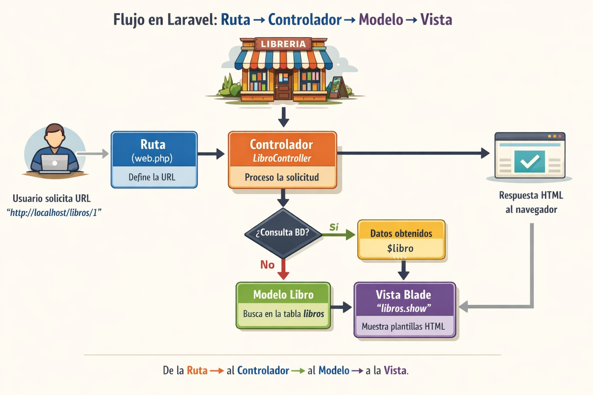

# Introducción a Laravel

 <a href="https://aitor-medrano.github.io/dwes2122/07frameworks.html">Apuntes de Aitor Medrano</a>

## Laravel
Laravel es un framework de desarrollo de aplicaciones web de código abierto y de alto nivel, escrito en PHP. Fue creado por Taylor Otwell en 2011 y se ha convertido en uno de los frameworks más populares y ampliamente utilizados en la comunidad de desarrollo web.

Laravel sigue el patrón de diseño MVC (Modelo-Vista-Controlador), lo que proporciona una estructura organizada y modular para construir aplicaciones web. Proporciona una amplia gama de características y herramientas que facilitan el desarrollo rápido y eficiente de aplicaciones web robustas y escalables.

Algunas de las características destacadas de Laravel incluyen:

1. Enrutamiento: Laravel proporciona un sistema de enrutamiento fácil de usar que permite definir rutas para diferentes URI y métodos HTTP.

2. ORM (Object-Relational Mapping): Laravel incluye un ORM llamado Eloquent, que simplifica la interacción con la base de datos al proporcionar una forma intuitiva de trabajar con modelos y consultas.

3. Migraciones de base de datos: Laravel ofrece migraciones de base de datos, que permiten mantener el control de los cambios en la estructura de la base de datos a través de archivos de migración.

4. Plantillas Blade: Laravel utiliza el motor de plantillas Blade, que proporciona una sintaxis sencilla y expresiva para trabajar con vistas y facilita la reutilización de código.

5. Autenticación y autorización: Laravel proporciona un sistema de autenticación y autorización completo y fácil de usar, que incluye características como el registro de usuarios, inicio de sesión, restablecimiento de contraseñas y control de acceso basado en roles.

6. Pruebas automatizadas: Laravel tiene soporte integrado para pruebas automatizadas, lo que facilita la escritura y ejecución de pruebas unitarias y de integración para garantizar la calidad del código.

El modelo de funcionamiento es el siguiente:


## Estructura de un proyecto Laravel
La estructura de un proyecto de Laravel sigue una convención bien definida que organiza los archivos y directorios de manera lógica y coherente. Aquí tienes una descripción de los principales directorios y archivos en un proyecto de Laravel:

1. `app`: Este directorio es el corazón de la aplicación y contiene la lógica de negocio de tu proyecto. Aquí encontrarás los modelos (archivos que representan las tablas de la base de datos), controladores (archivos que manejan las solicitudes HTTP y orquestan la lógica de la aplicación) y otros archivos relacionados con la lógica de la aplicación.

2. `bootstrap`: Este directorio contiene archivos relacionados con el inicio de la aplicación, como la carga de la configuración y la configuración del autoloading de clases.

3. `config`: Aquí se encuentran los archivos de configuración de la aplicación. Puedes definir la configuración de la base de datos, el correo electrónico, el almacenamiento en caché y otros aspectos de la aplicación en estos archivos.

4. `database`: En este directorio se encuentran los archivos relacionados con la base de datos. Aquí puedes definir las migraciones (archivos que representan cambios en la estructura de la base de datos), los seeders (archivos que se utilizan para poblar la base de datos con datos de prueba) y otros archivos relacionados con la base de datos.

5. `public`: Este directorio es el punto de entrada de tu aplicación y contiene el archivo `index.php`, que es el archivo que se ejecuta cuando se realiza una solicitud HTTP a tu aplicación. También encontrarás archivos estáticos como imágenes, hojas de estilo CSS y archivos JavaScript en este directorio.

6. `resources`: Aquí se almacenan los recursos de la aplicación, como las vistas (archivos de plantillas que definen la interfaz de usuario), los archivos de lenguaje y los archivos de assets (como hojas de estilo y scripts JavaScript) sin compilar.

7. `routes`: En este directorio encontrarás los archivos de definición de rutas de tu aplicación. Las rutas determinan cómo se manejan las solicitudes HTTP y qué controlador y método se ejecutan para cada ruta.

8. `storage`: Este directorio almacena archivos generados por la aplicación, como archivos de registro, archivos de sesión y archivos cargados por los usuarios. También contiene subdirectorios para almacenar archivos en caché, vistas compiladas y otros archivos generados.

9. `tests`: Aquí se encuentran los archivos de pruebas de tu aplicación. Laravel incluye un sistema de pruebas integrado que te permite escribir y ejecutar pruebas unitarias y de integración para asegurarte de que tu código funcione correctamente.

10. `vendor`: Este directorio contiene las dependencias de tu proyecto, que son administradas por Composer, el administrador de paquetes de PHP. Aquí se almacenan los paquetes y bibliotecas de terceros utilizados en tu proyecto.

Además de estos directorios principales, también encontrarás archivos como `.env` (archivo de configuración de variables de entorno), `composer.json` (archivo de configuración de Composer) y otros archivos de configuración y utilidad.

Esta es una descripción general de la estructura de un proyecto de Laravel. Cabe destacar que Laravel es altamente personalizable y puedes ajustar la estructura y los nombres de los directorios según tus necesidades, utilizando las configuraciones y convenciones proporcionadas por el framework.


## Instalación de laravel
Las herramientas o tooling que necesitamos para laravel son:
- PHP
- Composer
- node js (no es estrictamente necesario, pero para vistas avanzadasl, por ejemplo, para usar *vite* lo necesitamos)
- XAMPP (Apache + MYSQL)

Existe un entorno llamado **Laravel Herd** que se encarga de instalarlo todo, permite dominios automáticos, gestion de versiones de PHP, etc. Pero, en un entorno de inicio, educativo, no es necesario. Además, tenemos instalado casi todo lo que necesitamos.

### Crear nuevo proyecto en Laravel sin el instalador de laravel
De esta forma vamos más paso a paso.
```
#composer create-project --prefer-dist laravel/laravel blog
#cp .env.example .env
—> Acceder a .env y poner los parámetros de configuración de la bbdd
#php artisan key:generate
#php artisan migrate
#php artisan serve
```

### Crear nuevo proyecto con el instalador de laravel
Hay que instalar el instalador de forma global con
```
>composer global require laravel/installer
```
Una vez instalado, asegurarnos que el comando `#laravel` esta accesible. Sino, incluir en el path
la ruta $HOME/.composer/vendor/bin, que es donde está dicho comando.

Mac/Linux
Editar el archivo .profile o .zprofile del directorio home del usuario. 
```
export PATH="/Applications/XAMPP/bin:$PATH"
export PATH="$HOME/.composer/vendor/bin:$PATH"
```

Para crear un nuveo proyecto, se hace todo con un solo comando. Simple.  
```
>laravel new blog       creamos un nuevo proyecto llamado blog
>composer run dev       lanzamos el servidor
```

¿Qué ocurre si tenemos algún parámetro de nuetra base de datos distinto al por defecto? Este comando, al indicarle la base de datos, usa el puerto por defecto, así como el usuario y contraseña por defecto.

Si hubiera que cambiar algún parámetro, haremos lo siguiente. Solo lo haremos una vez. Cuando esté todo configurado bien, solamente ejecutar `#composer run dev`.
```
—> Acceder a .env y poner los parámetros de configuración de la bbdd
-> Crear la base de datos si no lo  estuviera. El nombre debe coincidir con el puesto en .env, es decir "CREATE DATABASE proyecto"
>php artisan config:clear          para limpiar cache
>php artisan optimize:clear         para limpiar cache
>php artisan migrate
>composer run dev
```


### Renombrar un proyecto
Para renombrar un proyecto no hay ningun comando especial. Hay que hacer varias pasos. Lo mas importante es solamente cambiar el nombre de la carpera y limpiar configuraciones. ¿Y la base de datos? Se puede mantener con el mismo nombre pero no es muy ordenado. Así que mejor cambiarla también.
- Renombrar nombre de la carpeta del proyecto
- Cambiar el nombre de la app en .env `APP_NAME=nuevo_nombre`
- Cambiar el nombre de la base datos en .env `DB_DATABASE=nuevo_nombre`
- Crear la base de datos con PHPMyAdmin
- Limpiar cache con `php artisan config:clear`
- Crear las migraciones de la bbdd `php artisan migrate`

- OPCIONAL: cambiar en composer.json el nombre de la app y luego `composer dump-autoload`


## Introducción a las rutas. Definición y nombrado.
Las rutas web se definen en `routes/web.php`

📌 Ruta básica (si accedes a /, se muestra la vista 'home')
```  
Route::get('/', function () {
    return view('home');
});
```
Para que esto funcione, tenemos que tener una vista llamada `home.php` o `home.blade.php`, según si no queremos usar blade o sí, dentro de la carpeta `resources/views/`

Normalmente, a las rutas les asignamso un nombre para poder luego referenciarlas de manera sencilla, de la forma `<a href="{{ route('home') }}">Inicio</a>`

```
Route::get('/', function () {
    return view('home');
})->name('home');

Route::get('/contacto', function () {
    return view('contacto');
})->name('home');

```

Si una vista esta en una subcarpeta de views, se referencia con el punto. Por ejemplo, si tenemos la estructura `resources/views/miscosas/curriculo.blade.php`, para referencias a estra vista, lo haremos con `view('miscosas.curriculo')`


## Motor de plantillas Blade

IMPORTANTE: vamos a usar herencia de plantillas (más antiguo) en lugar de componentes (más moderno) para el layout con Blade.

<a href="https://www.cloudways.com/blog/create-laravel-blade-layout/">Apuntes Layout en Blade</a>

Blade es el motor de plantillas de Laravel. Permite:
	•	Reutilizar vistas
	•	Separar estructura y contenido
	•	Usar PHP de forma limpia

📌 Sintaxis básica

{{ $variable }}          {{-- Mostrar datos --}}  
@if() @endif             {{-- Condicionales --}}  
@foreach() @endforeach   {{-- Bucles --}}  

⸻

### Layout genérico
Un layout es la estructura común de la web (HTML base). Con blade podemos crear plantillas y componentes que nos permiten reutilizar vistas. 
A la hora de definit el layout principal, este actua como padre y luego tiene como hijos el menú, el footer, el contenido. 

El layout o plantilla padre se suele definir en `resources/views/layouts/app.blade.php`

🧱 1. Ejemplo de layout

```html
<!DOCTYPE html>
<html lang="es">
<head>
    <meta charset="UTF-8">
    <title>@yield('title', 'Mi Web')</title>

    @vite(['resources/css/app.css', 'resources/js/app.js'])
</head>
<body>

    @include('partials.menu')

    <main class="container">
        @yield('content')
    </main>

    @include('partials.footer')

</body>
</html>
```

🧠 Directivas usadas  
@yield	Define un hueco de contenido  
@include	Incluye otra vista


⸻

🧭 2. Vistas menú y footer
Se usan para reutilizar fragmentos comunes. Se encuentran en `resources/views/partials/menu.blade.php`y `resources/views/partials/footer.blade.php`

📌 Ejemplo de menú
```html
<nav>
    <ul>
        <li><a href="{{ route('home') }}">Inicio</a></li>
        <li><a href="{{ route('about') }}">About</a></li>
    </ul>
</nav>
```

🏠 3. Vista hija (home)  
Una vista hija hereda del layout. Ubicada en `resources/views/home.blade.php`

🧱 Ejempplo
```blade
@extends('layouts.app')

@section('title', 'Inicio')

@section('content')
    <h1>Bienvenido</h1>
    <p>Página principal con Blade</p>
@endsection
```

🧠 Directivas usadas  
@extends	Hereda un layout  
@section	Rellena un @yield  


En blade, puedo usar funciones. Por ejemplo, para saber si actualemente enstamos en una ruta, y poder asignarle un estilo, usaremos `request()->routeIs('home')`, usando el nombre de la ruta 'home'. 
```html
Si estamos en la ruta 'home', asígnale la clase 'active'

<a href="{{ route('home') }}"
   class="{{ request()->routeIs('home') ? 'active' : '' }}">
   Inicio
</a>
```

## La arquitectura MVC
El patrón MVC (Modelo-Vista-Controlador) es una arquitectura de software que separa una aplicación en tres componentes principales para organizar mejor el código y facilitar su mantenimiento. El Modelo se encarga de la gestión de los datos y la lógica de negocio, interactuando con la base de datos y representando las entidades del sistema, como por ejemplo un libro o un usuario. La Vista es la capa encargada de la presentación, mostrando la información al usuario mediante plantillas o interfaces gráficas. Por último, el Controlador actúa como intermediario entre la Vista y el Modelo, recibiendo las solicitudes del usuario, procesando la lógica necesaria y enviando los datos correspondientes a la Vista.

El uso del patrón MVC permite separar responsabilidades, lo que facilita la escalabilidad y el trabajo en equipo, ya que desarrolladores pueden trabajar en la lógica, en la interfaz o en la base de datos de manera independiente. Además, mejora la mantenibilidad del código y la reutilización de componentes, y es ampliamente utilizado en frameworks modernos como Laravel, Ruby on Rails o ASP.NET, donde las rutas llevan al controlador, este interactúa con el modelo y finalmente devuelve la vista al usuario.



- **Modelo:** gestiona los datos y la lógica de negocio; se comunica con la base de datos.
- **Vista:** muestra la información al usuario mediante plantillas o interfaces gráficas.
- **Controlador:** recibe las solicitudes del usuario, procesa la lógica y envía los datos a la vista.
- **Ventaja:** separa responsabilidades, facilita mantenimiento, reutilización de código y trabajo en equipo.
- **Uso:** ampliamente usado en frameworks modernos como Laravel, donde las rutas llaman al controlador, este usa el modelo y devuelve la vista.


## Crear controladores y sus rutas
Normalmente, a la hora de manejar datos, no se le pasan directamente a las vistas. Usamos una estructura MVC, modelo., vista, controlador. 

El controlador recibe la petición, decide qué hacer y devuelve una respuesta (texto, vista o datos).

### 1. Creamos el controlador
Podemos crear un controlador con unos métodos ya predefinidos (-r de controlador de recursos), pero vamos a crearnos nuestro controlador vacio y luego programaremos los métodos que queramos.
`php artisan make:controller LibroController`

Esto crea el controlador en `app/Http/Controllers/`

### 2. Programamos el controlador
```php
 class LibroController extends Controller
{
    // Listar libros
    public function index()
    {
        return "Listado de libros";
    }

    // Mostrar formulario de creación
    public function create()
    {
        return "Formulario para crear libro";
    }

    // Mostrar un libro concreto
    public function show($id)
    {
        return "Mostrando el libro con ID: " . $id;
    }
}
```
### 3. Creamos las rutas, esta vez, usando el controlador
```php
use App\Http\Controllers\LibroController;

Route::get('/libros', [LibroController::class, 'index']);
Route::get('/libros/crear', [LibroController::class, 'create']);
Route::get('/libros/{id}', [LibroController::class, 'show']); //-> where('id', '[0-9]+');
```


## Crear el modelo y diseñar las migraciones
El siguiente paso es crear el modelo (la clase libro) y la tabla en la bbdd. 

`php artisan make:model Libro -m`

Esto hace dos cosas:

1.	Crea el archivo del modelo en app/Models/Libro.php
2.	Crea una migración en database/migrations/xxxx_xx_xx_create_libros_table.php

```php
 public function up(): void
{
    Schema::create('libros', function (Blueprint $table) {
        $table->id();                   // ID autoincremental
        $table->string('titulo');       // Título del libro
        $table->string('autor');        // Autor
        $table->integer('anio');        // Año de publicación
        $table->string('genero');       // Género
        $table->text('sinopsis')->nullable(); // Sinopsis, opcional
        $table->timestamps();           // created_at y updated_at
    });
}
```

Una vez diseñada la migración, debemos ejecutarla. Esto crea la tabla libros en tu base de datos configurada en .env:

`php artisan migrate`


## Usando los métodos del modelo para obtener datos

Ya podemos en nuestro controlador, usar la clase libro

```php
$libros = Libro::all(); //devuelve todos los libros
$libro = Libro::find($id); // busca el libro por ID
$libro = Libro::findOrFail($id); //si no existe, lanza 404
``` 

## Generando datos de forma masiva con factorías
Una Factory define cómo se crea un modelo con datos falsos (usando Faker).
Sirve para:
- Poblar la BBDD rápido
- Probar vistas
- Probar controladores y relaciones
- No meter datos “a mano”

### 1. Crear la factoría
Para generar la factoría, que se crearán en la ruta *database/factories/LibroFactory.php*

`php artisan make:factory LibroFactory --model=Libro`


### 2. Definir los datos falsos (Faker)
Debemos ir a la factoria creada e indicar como se van a generar los datos falsos, que formato tienen. Faker genera datos realistas (no random cutre).

```php
namespace Database\Factories;

use Illuminate\Database\Eloquent\Factories\Factory;

class LibroFactory extends Factory
{
    public function definition(): array
    {
        return [
            'titulo' => $this->faker->sentence(3),
            'autor' => $this->faker->name(),
            'anio' => $this->faker->numberBetween(1950, 2024),
            'isbn' => $this->faker->unique()->isbn13(),
            'descripcion' => $this->faker->paragraph(3),
        ];
    }
}
```
Si tuviéramos un campo *genero*, no existe un faker “oficial” tipo ->genre(), así que lo normal es usar una lista controlada. De hecho, es lo más realista.

```php
'genero' => $this->faker->randomElement([
    'Novela',
    'Ciencia ficción',
    'Fantasía',
    'Romance',
    'Terror'
    ])
``` 


### 3. Activar la factoria en el modelo 
Abre app/Models/Libro.php y añade los campos que se pueden llenar masivamente (fillable). Tanmbién es necesario para que Laravel pueda crear nuevos libros con el ORM (Eloquent).

```php
<?php

namespace App\Models;

use Illuminate\Database\Eloquent\Factories\HasFactory;
use Illuminate\Database\Eloquent\Model;

class Libro extends Model
{
    use HasFactory;

    protected $fillable = [
        'titulo',
        'autor',
        'anio',
        'genero',
        'sinopsis',
    ];
}
``` 


### 4. Generar los datos falsos
En *database/seeders/DatabaseSeeder.php*, para generar 10 registros:

```php
use App\Models\Libro;

public function run(): void
{
    Libro::factory()->count(10)->create();
}
``` 

Despues, ejecutaremos en el terminal:
`php artisan db:seed`

Si quisieamos borrar y regenerar todo:
`php artisan migrate:fresh --seed`

Para borrar solo todo el contenido de la base de datos
`php artisan migrate:fresh`


## 📘 Alta de libros en Laravel (Formulario)

### 1. Crear las rutas

Archivo: routes/web.php
```php
use App\Http\Controllers\LibroController;

Route::get('/libros/create', [LibroController::class, 'create'])
    ->name('libros.create');

Route::post('/libros', [LibroController::class, 'store'])
    ->name('libros.store');
``` 

	•	GET /libros/create → muestra el formulario
	•	POST /libros → procesa el envío del formulario


### 🎮 2. Controlador

Archivo: app/Http/Controllers/LibroController.php

```php
use App\Models\Libro;
use Illuminate\Http\Request;

class LibroController extends Controller
{
    public function create()
    {
        return view('libros.create');
    }

    public function store(Request $request)
    {
        $request->validate([
            'titulo' => 'required|string|max:255',
            'autor' => 'required|string|max:255',
            'genero' => 'required|string',
            'anio' => 'nullable|integer|min:1500|max:' . date('Y'),
            'isbn' => 'nullable|string|unique:libros,isbn',
            'descripcion' => 'nullable|string',
        ]);

        Libro::create($request->all());

        return redirect()->route('libros.index')
                         ->with('success', 'Libro creado correctamente');
    }
}
``` 


📌 Puntos clave
- validate() comprueba los datos antes de guardar
- Libro::create() inserta en la base de datos
- redirect()->route() vuelve al listado
- with() envía un mensaje flash


### 🎨 4. Vista del formulario (Blade)

Archivo: resources/views/libros/create.blade.php

```php
@section('content')
<h1>Alta de nuevo libro</h1>

@if ($errors->any())
    <ul style="color:red">
        @foreach ($errors->all() as $error)
            <li>{{ $error }}</li>
        @endforeach
    </ul>
@endif


<form action="{{ route('libros.store') }}" method="POST">
    @csrf

    <label>
        Título:
        <input type="text" name="titulo" value="{{ old('titulo') }}">
    </label><br><br>

    <label>
        Autor:
        <input type="text" name="autor" value="{{ old('autor') }}">
    </label><br><br>

    <label>
        Género:
        <select name="genero">
            <option value="">-- Selecciona --</option>
            @foreach (['Novela','Fantasía','Terror','Romance','Ensayo'] as $genero)
                <option value="{{ $genero }}" 
                    {{ old('genero') == $genero ? 'selected' : '' }}>
                    {{ $genero }}
                </option>
            @endforeach
        </select>
    </label><br><br>

    <label>
        Año:
        <input type="number" name="anio" value="{{ old('anio') }}">
    </label><br><br>

    <label>
        ISBN:
        <input type="text" name="isbn" value="{{ old('isbn') }}">
    </label><br><br>

    <label>
        Descripción:
        <textarea name="descripcion">{{ old('descripcion') }}</textarea>
    </label><br><br>

    <button type="submit">Guardar libro</button>
</form>

@endsection
```


## Laravel: Seguridad CSRF y uso del _token

### 1️⃣ ¿Qué es CSRF?

CSRF significa Cross-Site Request Forgery (falsificación de petición en sitios cruzados).
- Es un ataque donde un usuario autenticado puede ser engañado para enviar un formulario sin querer.
- Por ejemplo, alguien podría hacer que tu navegador envíe un formulario a tu aplicación y cambie datos sin tu consentimiento.

### 2️⃣ Cómo lo previene Laravel

Laravel genera automáticamente un token único para cada sesión de usuario.
- Este token se incluye en cada formulario con @csrf:

```php
<form action="/libros/guardar" method="POST">
    @csrf
    <input type="text" name="titulo">
    <button type="submit">Guardar</button>
</form>
``` 

- @csrf genera algo como 

`<input type="hidden" name="_token" value="eyJpdiI6Ij...">`

- Laravel verifica que el token enviado coincida con el de la sesión.
- Si no coincide, Laravel rechaza la petición con error 419 (CSRF token mismatch).


### 3️⃣ Resumen
- _token protege los formularios contra envíos maliciosos desde sitios externos.
- Siempre que uses POST, PUT, PATCH o DELETE, necesitas @csrf.
- GET no necesita token, porque no modifica datos.
- Laravel maneja el token automáticamente, solo asegúrate de no olvidarlo en los formularios.


       

## Crear modelo + todo lo necesario de golpe en Laravel

Laravel permite generar **modelo, migración, controlador y factory** con un solo comando usando `artisan` (m de migracion, f de factoria y c de controlador).

`php artisan make:model Post -mfc`

Si además queremos que en el controlador aparezcan los típicos métodos de un controlador REST (index(),create(),store(),show(),edit(),update(),destroy()), añadiremoos -resource

`php artisan make:model Post -mfc --resource`

Se generarán los archivos:
```
app/Models/Post.php
database/migrations/xxxx_create_posts_table.php
app/Http/Controllers/PostController.php
database/factories/PostFactory.php
``` 

