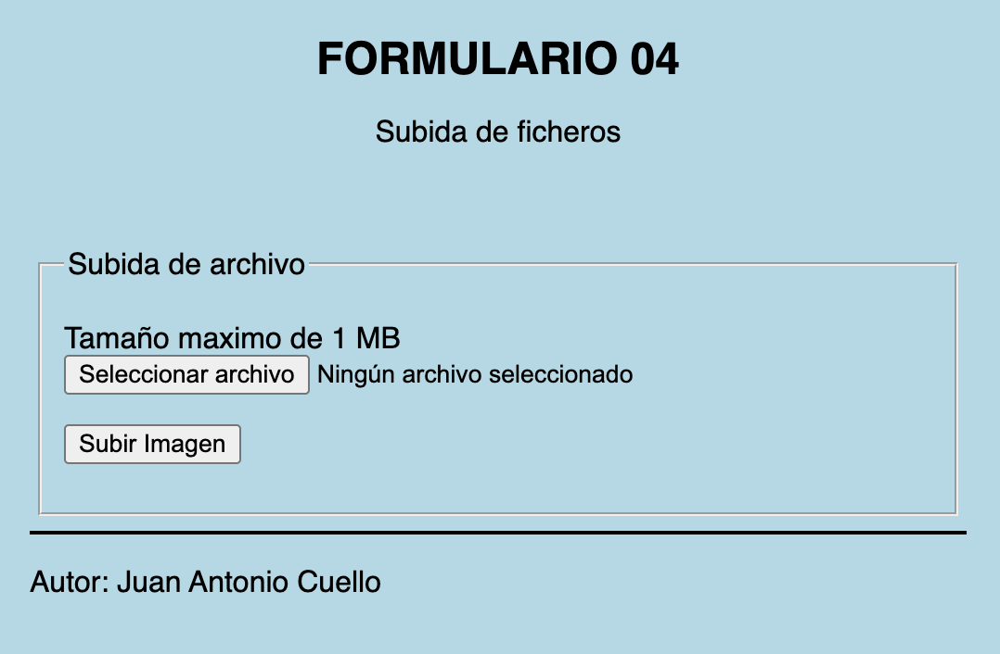
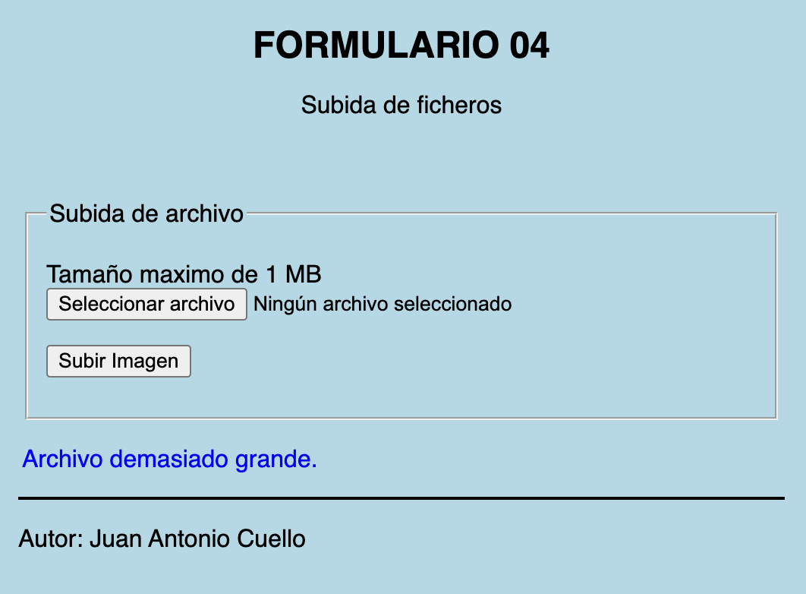
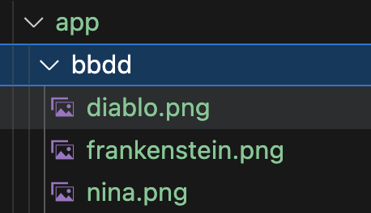

# FORMULARIO 4

## Manejo de ficheros
Crear un formulario para subir un fichero. El formulario se enviará a si mismo. La imagen se guardará con el mismo nombre en la carpeta bbdd. 
No se permiten subir imágenes con un tamaño superior a 1MB.

Al subir una imagen, toda la información de la misma se encuentra en el array `$_FILES[]`

Una vez subida la imagen, se mostrará información de la misma y la propia imagen (en tamaño pequeño).
Adicionalmente, y usando la función proporcionada, al subir una imagen indicarás cuantas imágenes hay en la bbdd.

Se proporciona la siguiente funcion:
- **numero_ficheros_directorio($ruta)**: se proporciona esta función que te devuelve el numero de ficheros que encuentre en un directorio. 

## Vistas de la app

  

  

  

