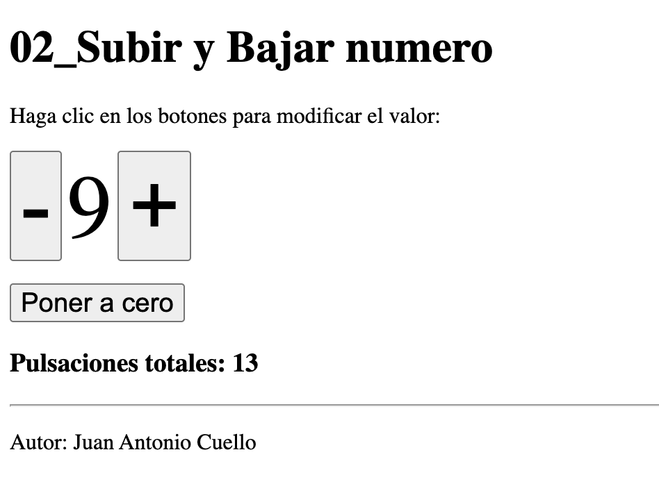

## 02 BOTÓN MAS Y MENOS

## Sesiones
Escriba un programa **de dos páginas** que muestre un valor numérico y permita subirlo o bajarlo mediante dos botones. Los valores mínimo y máximo a mostrar son 0 y 9 respectivamente. Si llegamos a esos valores límite, al pulsar el botón no haremos nada.

- La primera página contiene un formulario con tres botones de tipo submit con el mismo name.
- La segunda página recibe el dato, modifica el número y redirige a la primera página.
- El número se guarda en una variable de sesión. Si la variable no está definida, se le dará el valor 0.

## Cookies
Añade un contador de pulsaciones totales con una cookie, para que se mantenga aunque cierres el navegador. Cuando pulses el botón de poner a cero, el conrtador de pulsaciones se pondrá a 0.

