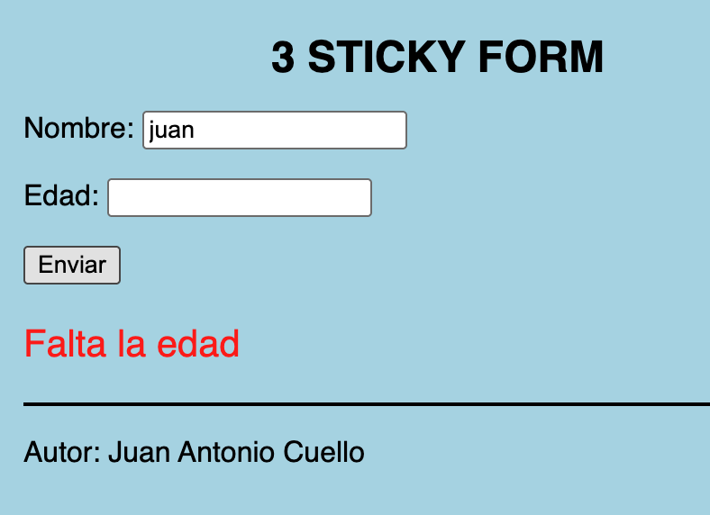
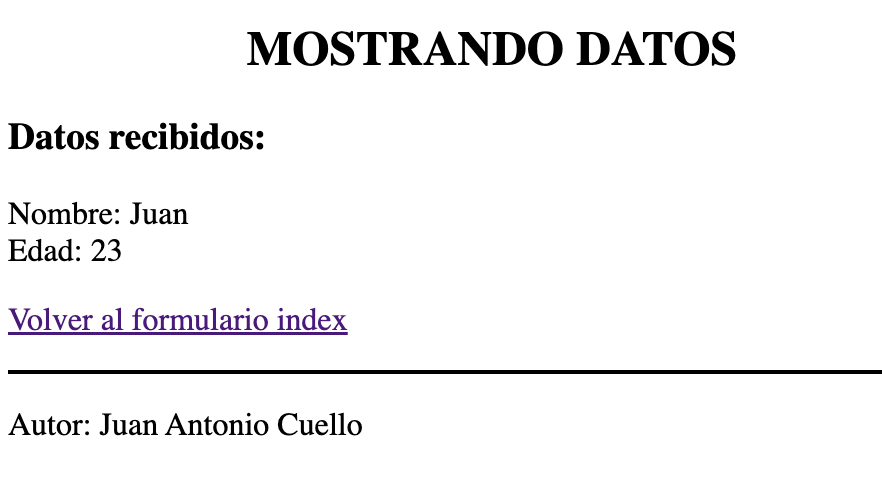
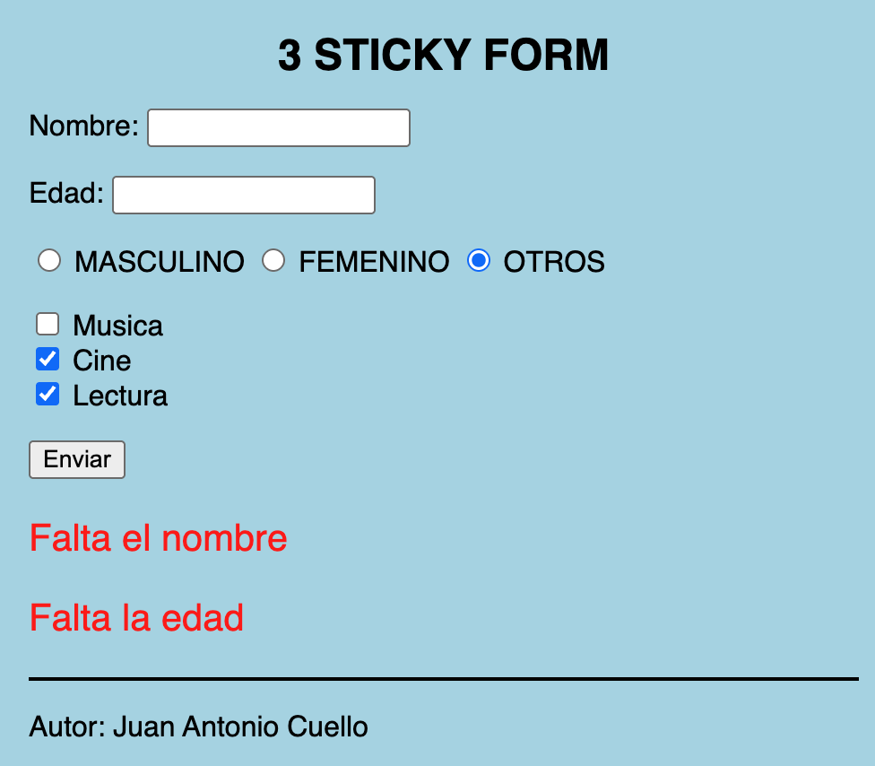

## 03 STICKY FORM

Un “sticky form” en PHP (o en cualquier lenguaje web) es un formulario que mantiene los datos introducidos por el usuario después de enviar el formulario, generalmente tras un error de validación o un reenvío. Cuando el usuario envía un formulario con errores (por ejemplo, deja un campo vacío), el formulario “se queda pegado” (sticky) con los valores que ya había introducido, para que no tenga que volver a escribir todo.

## Enuciado
Crear un formulario que recuerde los valores en caso de error. El formlario tendrá los campos de nombre y edad. Quita el atributo *required* del html para poder forzar a dejarlo vacio.

Ficheros a usar:
- index.php: el formulario
- procesar.php: quien recoge los datos del formulario
- mostrardatos.php: vista donde me muestran los datos cuando están todos correctos.







## Mejora
Añade al form el campo de sexo y varios checkbox con las aficiones (como en el tema2/formularios/form02).

Te adjunto un ejemplo de como tratar estos dos nuevos controles

```php
 <input type="radio" id="sexo_masculino" name="sexo" value="M" <?php echo isset($_SESSION['sexo']) && $_SESSION['sexo']=="M" ? "checked" : ""; ?> >
<label for="sexo_masculino">MASCULINO</label>
```

```php
$aficiones = $_SESSION["aficiones"] ?? [];

 <input type="checkbox" name="aficiones[]" value="musica" <?php if(in_array("musica",$aficiones)) echo "checked"; ?> > Musica<br />
 ```



