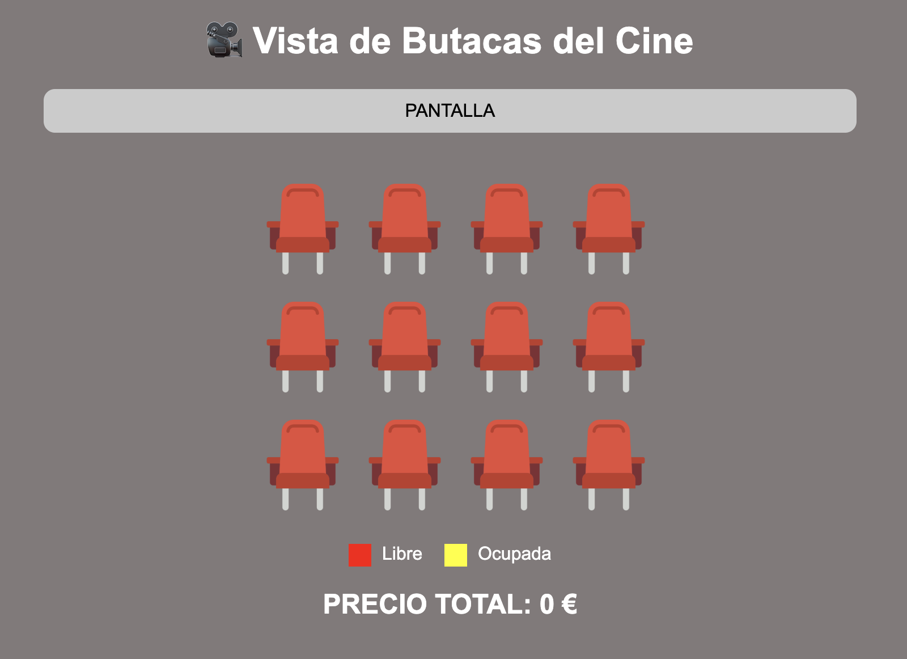
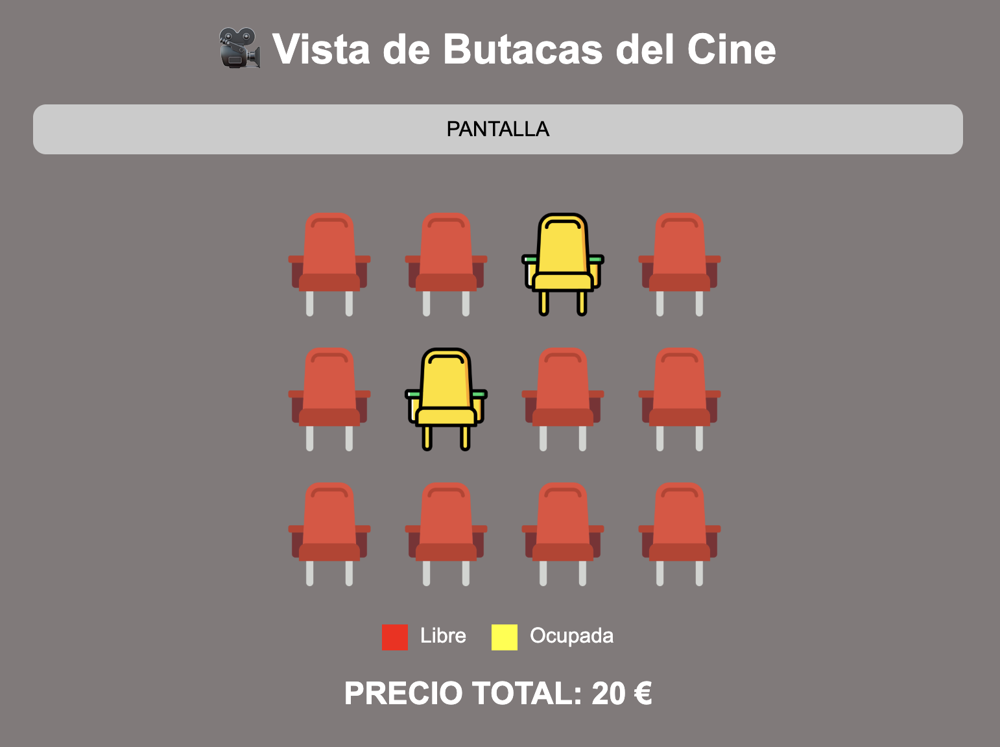
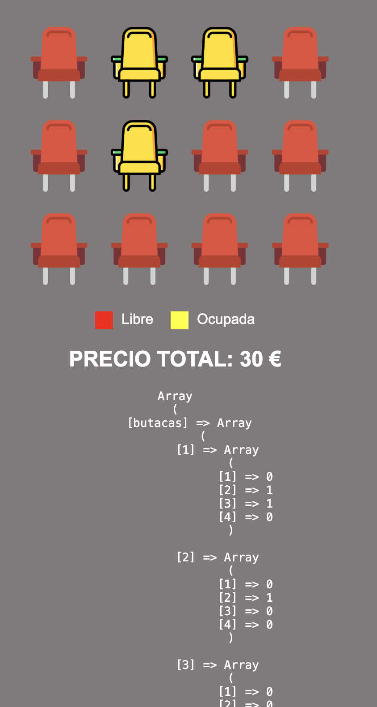

## 04 BUTACAS

Hacer una vista que permita seleccionar butacas en un cine de 3 filas y 4 columnas, haciendo click sobre ellas. Cada butaca cuesta 10€ y te mostrará el precio total. **Es posible desseleccinar una butaca**. 

Solo usarás una archivo para la vista y el procesamiento. Para llevar var control de las butacas, usaras una variable de sesión `$_SESSION['butacas']` que guardará un array indexado bidimiensional, de [filas][columnas]. Si la butaca esta libre tendrá el valor cero y si está ocupada el valor 1.

Para mostrar las imágenes, usarás dos archivos de imagen. Otra opción sería usar un `<div>` y darle color con CSS.

Para calcular el precio, puedes usar una función o usar varible de session que vaya cambiando dinámicamente.

Hay varias posibles formas de hacerlo, de entre ellas:
- FORMA1: Mostraras las butacas usando grid css. Hay que programarlo, es decir, no poner las 12 butacas. Despues de las butacas, un solo formulario con dos campos *input hidden* para enviar la fila y la columna selecciona. Usarás javascript para detectar la butaca pulsada en pasar el hidden la fila y la columna de la butaca.

```html
<div class="sala">
    <div>
      
    </div>
  
    <div>
      
    </div>
    ...
</div>           
```

```javascript
<script>
// Al hacer clic en una imagen, guarda el número y envía el formulario. 
// Vamos a usar DATASET. Para ello, en las imagenes incluifremos el 
// atributo 'data-fila' y 'data-columna'

document.querySelectorAll('.butaca').forEach(butaca => {
  butaca.addEventListener('click', () => {
    const fila = butaca.dataset.fila;
    const columna = butaca.dataset.columna;

    console.log("fila:"+fila);
    console.log("columna:"+columna);
        
    //Asignamos a los campos input hidden el valor
    document.getElementById('fila_seleccionada').value = fila;
    document.getElementById('columna_seleccionada').value = columna;
    document.getElementById('formButacas').submit();
  });
});
</script>
```

## CAMBIO DE VIDA DE AL SESIÓN
Queremos que aunque se cierre el navegador, se siga recordando las butacas seleccionadas durante 1 día. Esto con cookies no se puede hacer, porque necesitariamos 12 cookies. Totalmente posible pero ineficiente. 
Las sesiones por defecto duran hasta que se cierra el navegador, pero, en realidad, se pueden prolongar el tiempo que queramos. Basta con:

```php
// Duración en segundos (24 horas = 86400 segundos)
$duracion = 86400;

// Ajustar el tiempo de vida de la cookie de sesión
session_set_cookie_params($duracion);

// Iniciar la sesión
session_start();
```

## VISTAS






