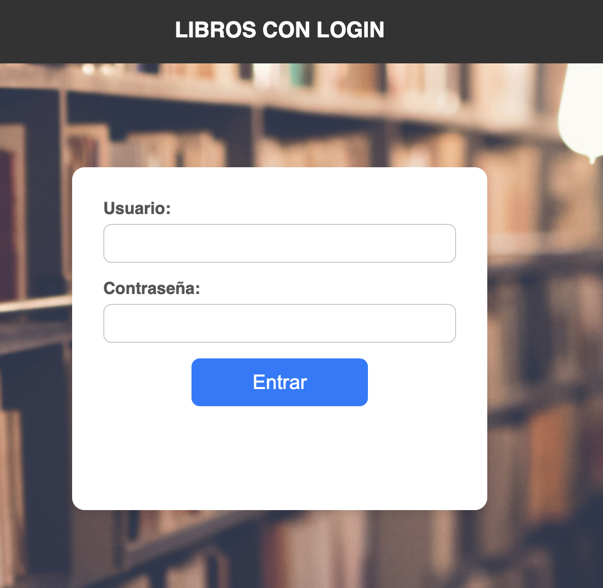

# LISTADO DE LIBROS CON LOGIN  

Vamos a modificar el ejercicio de la lista de libros (tema2/formularios/form06). Introduciremos nuevas mejoras:
- Hay que loguearse en la app para poder acceder a su operativa, es decir, poder ver el listado y poder incluir un nuevo libro. 
- Al loguearnos, en el menú aparecerá el nombre del usuario logueado y tendremos una opción de CERRAR SESIÓN.
- Vamos a incluir en el listado un botón en cada libro para BORRAR el libro y otro botón para VER los datos del libro en una página aparte, con la portada grande. 


## LOGIN
Usaremos sesiones para saber si estamos o no logueados. Guardaremos el usuario logueado en `$_SESSION["usuario"]`. Para simplificar el ejercicio, supondremos que solo hay unas credenciales y son **admin/1234**. Si se intenta acceder a cualquier parte de la app sin estar logueado, nos redirigirá a la pantalla de login.

<div style="text-align:center"></div>


## MENU
Queremos que el menú sea algo parecido a esto. Las opciones de la izquierda podrían ser dos: Listado y Alta. En este ejercicio, solo hay un tipo de menú, puesto que si no estamos logueados, nunca lo veremos. En otras apps, dependiendo de si estamos logueados o de si tenemos un rol u otro, vemos unas u otras opciones. 

```html
<?php if (isset($_SESSION['usuario'])): ?>
      <!-- opciones si estamos logueados --> 
      <li>...</li>
      <li>...</li>
    
<?php endif; ?>
```


Podemos dejar la pagina del perfil mínima, en construcción.


## BOTON VER Y BORRAR
Vamos a incluir en el listado de los libros un par de botones. Un botón para VER los datos del libro en una página aparte y un botón parta BORRAR un libro del json. Ambos botones llamarán a los archivos `ver.php` y `borrar.php`. Además, vas a crear dos funciones que serán llamadas: `obtenerLibro($titulo)` y `borrarLibro($titulo)`. A la hora de implementar la acción de ambos botones, como no tenemos un ID de cada libro, vamos a usar el título del libro como identificador. Usaremos dos formas, una con cada botón, de implementar estas acciones:

### Botón BORRAR
Crearemos un formulario enviando el título en un campo oculto. Hay que crear un formulario por cada libro/botón/elemento de la tabla. Si metemos toda la tabla en un único formulario, al tener todos los campos hiddden con el mismo name, se va a enviar el último título. 

```html
<form action="borrar.php" method="POST">
                    <input type="hidden" name="titulo_a_borrar" value="Dune"> 
                    <button class="borrar-boton" type="submit">BORRAR</button>
                    </form> 
```


### Botón VER
Usaremo un enlace `<a>`y en la URL del enlace le pasamos como parámetro (tipo GET) el título del libro 

`<a class="ver-enlace" href="ver.php?titulo=Dune">VER</a>`


<div style="text-align:center"></div>


## VISTA DEL LIBRO
Crearemos una página `ver.php` donde mostraremos los datos del libro, con la portada a 250 pixeles. Todo centrado.


<div style="text-align:center"></div>

## OPCIONAL
Programar tambien una alta de usuarios. 


