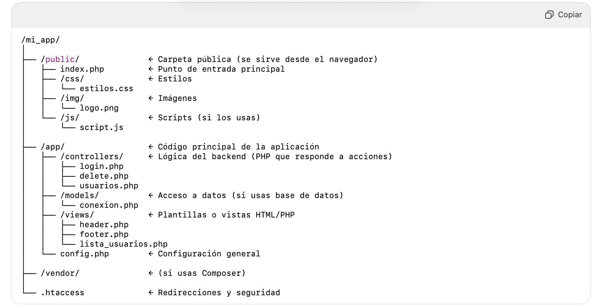

# CRUD USUARIOS  

Hacer una CRUD para gestionar usuarios, guardando estos es una base de datos MySQL. Puedes ver los campos en la tabla del script SQL. 

- Vamos a usar una clase `basedatos.php` para gestionar la conexión y consulta a la base de datos. Usará el patrón singleton.
- Los estilos no son relevantes.
- Usaras la estructua de archivos indicada en la imagen más abajo.
- Usaras `__DIR__` con los `include` y `require` para evitar errores en las rutas
- El nombre del usuario es calculado, a partir del nombre y los apellidos. Tendrá el formato `nombre.apellido1`
- El password se guardará cifrado (por defecto, si no se indica password, se guarda `no-password`).
- Mostrar en la vista detalle de cada usuario la edad del mismo. 


### Script SQL

```sql
DROP DATABASE IF EXISTS usuariosDB;
CREATE DATABASE usuariosDB CHARACTER SET utf8mb4;
USE usuariosDB;


CREATE TABLE `usuarios` (
  `id` int(11) NOT NULL AUTO_INCREMENT,
  `nombre` varchar(255) NOT NULL,
  `apellidos` varchar(255) DEFAULT NULL,
  `usuario` varchar(255) NOT NULL,
  `password` varchar(255) DEFAULT "no-password",
  `fecha_nac` datetime NOT NULL,
  PRIMARY KEY (`id`)
);


INSERT INTO usuarios (nombre, apellidos, usuario, fecha_nac) VALUES
('María', 'Gómez Ruiz', 'm.gomez', '1990-03-12'),
('Carlos', 'Fernández López', 'c.fernandez', '1985-07-25'),
('Lucía', 'Martínez Díaz', 'l.martinez', '1992-11-08'),
('Andrés', 'Sánchez Ortega', 'a.sanchez', '1998-04-17'),
('Elena', 'Torres Navarro', 'e.torres', '2000-01-30');
```


### Estructura de la app

<div style="text-align:center"></div>


