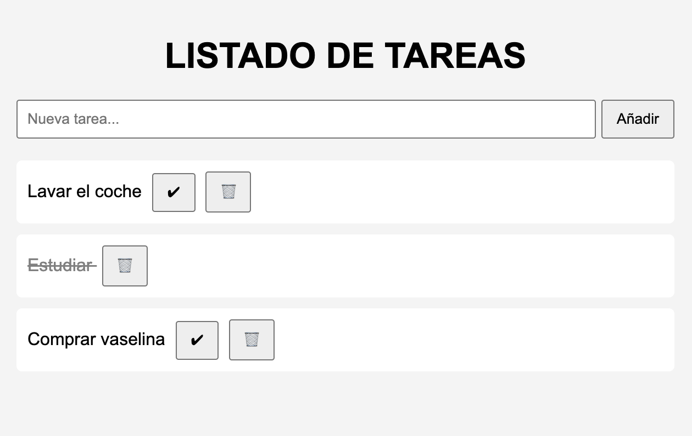

# LISTA DE TAREAS (ToDO)  

<div style="text-align:center"></div>

Hacer un ToDO, es decir, listado de tareas por hacer.

- Cuando completas una tarea, desaparece el botón de completar y cambia el estilo a tachado. Esto se hace aplicando estilos (se proporciona).
- Si pulsamos en la papelera, la tarea se borra.
- Tendremos dos clases: una para la base de datos y otra para la tarea. 
    - La clase `basedatos.php` para gestionar la conexión y consulta a la base de datos. Pero no es necesario usar el patrón singleton.
    - La clase `tarea.php` gestiona el objeto tarea. Aunque las tareas tinen fecha de creación, no se usan en el ejercicio.
- Usaras la estructua de archivos indicada en práctica anterior (CRUD).
- Usarás composer para cargar clases y funciones de ayuda (se proporciona la función).
- La función de ayuda es para sanitizar el formulario de la tarea.
- Usaras `__DIR__` en las rutas para evitar errores en las rutas.
- La configuración estará en un archivo `config.json`.


## Script SQL

```sql
DROP DATABASE IF EXISTS todo_db;

CREATE DATABASE todo_db CHARACTER SET utf8mb4 COLLATE utf8mb4_unicode_ci;
USE todo_db;

CREATE TABLE tareas (
    id INT AUTO_INCREMENT PRIMARY KEY,
    descripcion VARCHAR(255) NOT NULL,
    completada BOOLEAN DEFAULT FALSE,
    fecha_creacion DATETIME DEFAULT CURRENT_DATE
);

INSERT INTO tareas (descripcion, completada, fecha_creacion)
VALUES ('tarea de prueba', FALSE, '2000-01-01');

```


## Mejoras

Implementar las siguientes mejoras:
- Indicar el numero de tareas restantes por completar. 
- Hacer que la aplicación cree la base de datos y la tabla en lugar de cargar el script a mano. Para que no se creen las bases de datos por error, en el config.json **NO INDICARAS** el nombre de la base de datos. Lo pondrás directamente en código y puede ser **todo_db** por ejemplo.


### Posible ampliación
Meterle usuarios. Cada usuario tiene sus propias tareas.


