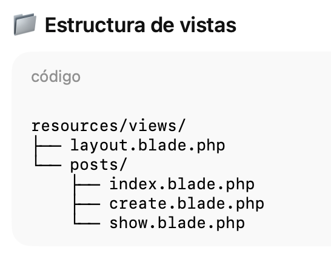

# 📝 Proyecto Laravel: MiniBlog de Artículos


## Estructura vistas




## layout.blade.php


```html
<!DOCTYPE html>
<html lang="es">
<head>
    <meta charset="UTF-8">
    <title>MiniBlog</title>
    <style>
        body {
            font-family: Arial, sans-serif;
            margin: 0;
            background: #f5f5f5;
        }

        header {
            background: #3366cc;
            color: white;
            padding: 15px 20px;
        }

        header a {
            color: white;
            text-decoration: none;
            margin-right: 15px;
        }

        header a:hover {
            text-decoration: underline;
        }

        .container {
            padding: 20px;
            max-width: 800px;
            margin: auto;
            background: white;
            margin-top: 20px;
            border-radius: 5px;
        }

        .post {
            margin-bottom: 20px;
            padding-bottom: 10px;
            border-bottom: 1px solid #ddd;
        }

        button {
            background: #3366cc;
            color: white;
            border: none;
            padding: 8px 15px;
            cursor: pointer;
            border-radius: 3px;
        }

        button:hover {
            background: #274a8c;
        }
    </style>
</head>
<body>

<header>
    <a href="{{ route('posts.index') }}">Inicio</a>
    <a href="{{ route('posts.create') }}">Nuevo post</a>
</header>

<div class="container">
    @yield('content')
</div>

</body>
</html>
```

## index.blade.php
```html
@extends('layout')

@section('content')
<h1>MiniBlog</h1>

<a href="{{ route('posts.create') }}">➕ Nuevo post</a>

<hr>

@foreach ($posts as $post)
    <div class="post">
        <h2>
            <a href="{{ route('posts.show', $post) }}">
                {{ $post->titulo }}
            </a>
        </h2>
        <small>Publicado el {{ $post->created_at->format('d/m/Y') }}</small>
    </div>
@endforeach
@endsection
```


## create.blade.php
```html
@extends('layout')

@section('content')
<h1>Nuevo post</h1>

<form action="{{ route('posts.store') }}" method="POST">
    @csrf

    <p>
        <label>Título</label><br>
        <input type="text" name="titulo" required>
    </p>

    <p>
        <label>Contenido</label><br>
        <textarea name="contenido" rows="5" required></textarea>
    </p>

    <button type="submit">Guardar</button>
</form>

<br>
<a href="{{ route('posts.index') }}">⬅ Volver</a>
@endsection
```

## show.blade.php
```html
@extends('layout')

@section('content')
<h1>{{ $post->titulo }}</h1>

<p>
    <small>Publicado el {{ $post->created_at->format('d/m/Y') }}</small>
</p>

<p>
    {{ $post->contenido }}
</p>

<a href="{{ route('posts.index') }}">⬅ Volver al listado</a>
@endsection
``` 


